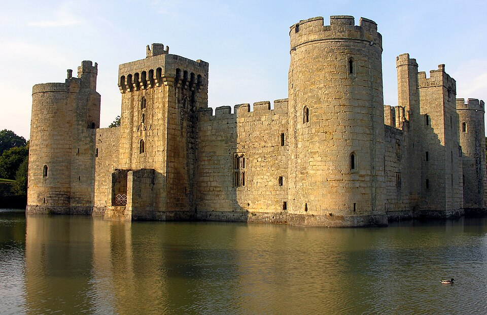
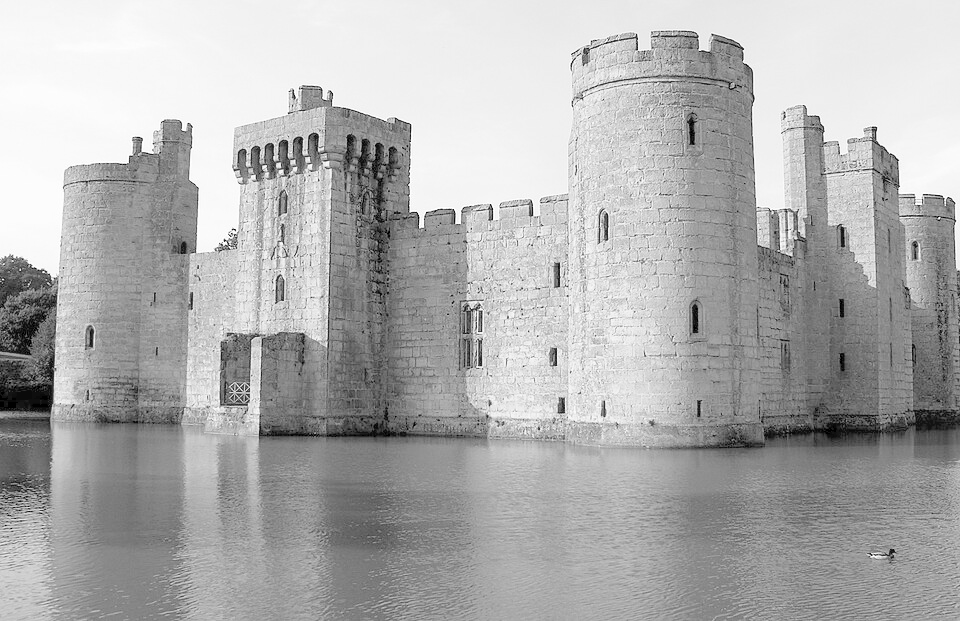
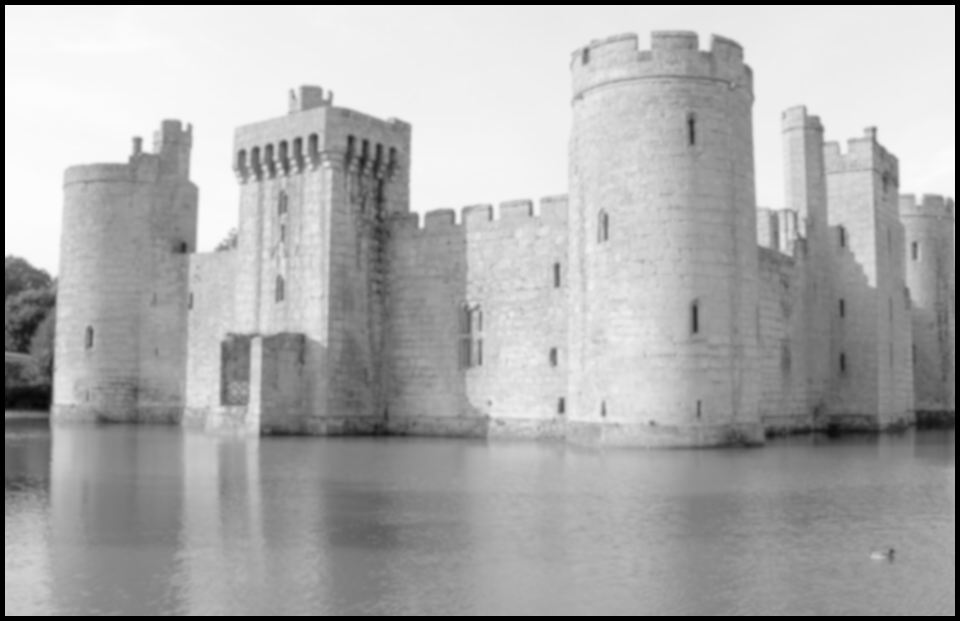
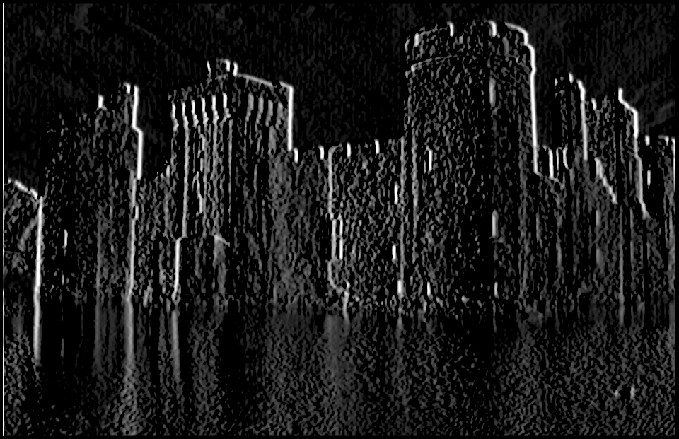
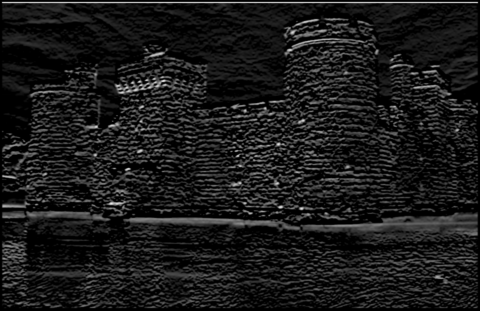
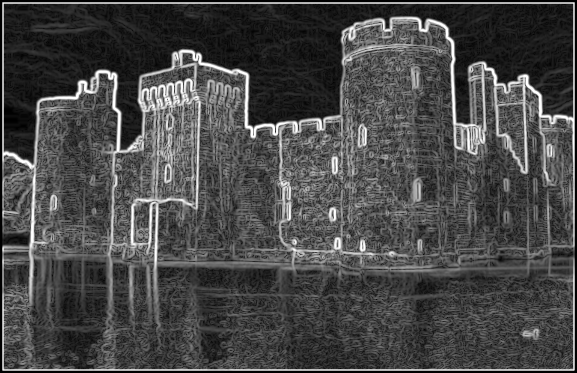
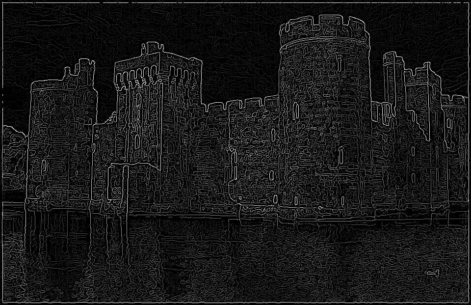
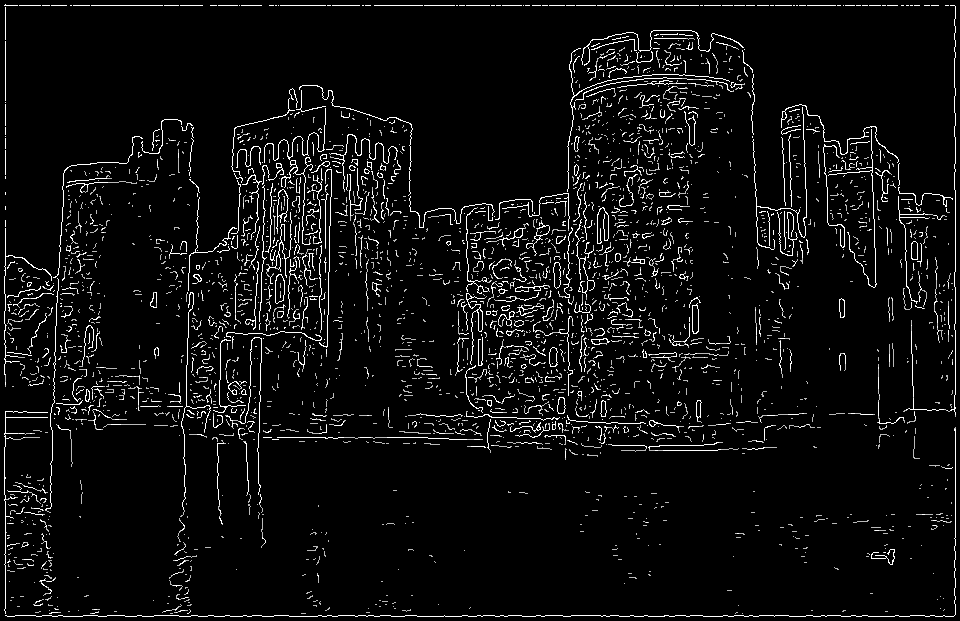

A little toy implementation of the [canny-edge-detection] algorithm in WPGU.

# Usage

```bash
cargo run --release -- <path to image file> <path to output directory>

# Example: Applies edge detection to the given image and saves each change after each step to the given output directory.
cargo run --release -- /tmp/image.png /tmp/output_dir
```

# Example

Here's an example which images will be generated.

## Source image (`example-images/castle.jpg`):



## 1. Gray scale



## 2. Gaussian filter



## 3. Horizontal and vertical edges

### 3.1 Horizontal edges



### 3.2 Vertical edges



## 4. Magnitude and radians

### 4.1 Magnitude



### 4.2 Radians


## 5. Non-maximum-suppression



## 6. Double Threshold



## 7. Edge tracking


# Sources to learn

- Canny algo: https://justin-liang.com/tutorials/canny/
- How to create gray scale: https://www.baeldung.com/cs/convert-rgb-to-grayscale

[canny-edge-detection]: https://en.wikipedia.org/wiki/Canny_edge_detector
